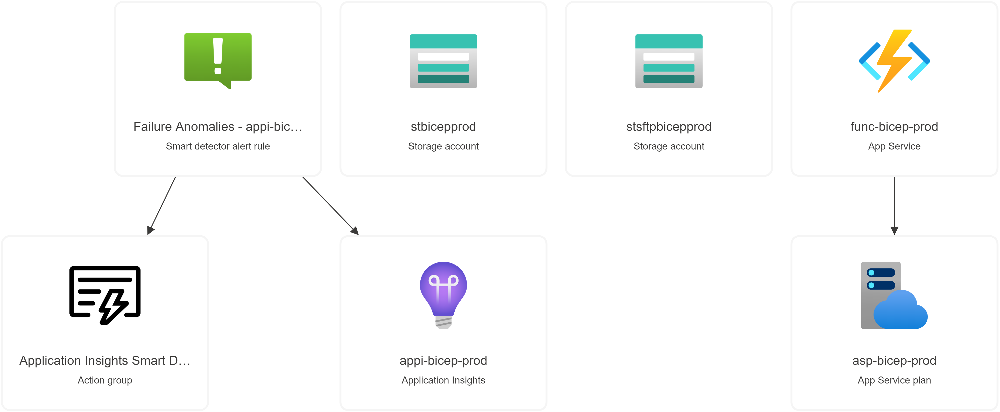

# 📂 Project Structure

The project consists of the following files and directories:

azureScript.ps1
compute.bicep
main.bicep
main.parameters.json
module/
app-service-plan.bicep
application-insight.bicep
function-app.bicep
storage-account.bicep
README.md

## 📄 Main Files

The `main.bicep` and `compute.bicep` files are responsible for setting up the main resources and compute resources for the project, respectively. They define various parameters such as the location, tags, and names of the resources, and they also include modules for deploying these resources.

The `main.parameters.json` file provides the values for these parameters, such as the names of the storage account, application insights resource, app service plan, and function app, as well as the SKU for the storage account and app service plan, and an API key.

The `azureScript.ps1` file is a PowerShell script that sets up Azure contexts, creates Azure AD applications, and assigns the Contributor role to the application. It also writes Azure secrets to the console. This script is essential for setting up the necessary Azure resources and permissions before deploying the resources defined in the `.bicep` files.

## 📁 Module Directory

The `module` directory contains `.bicep` files for each of the resources that are deployed, including the storage account, application insights resource, app service plan, and function app.
