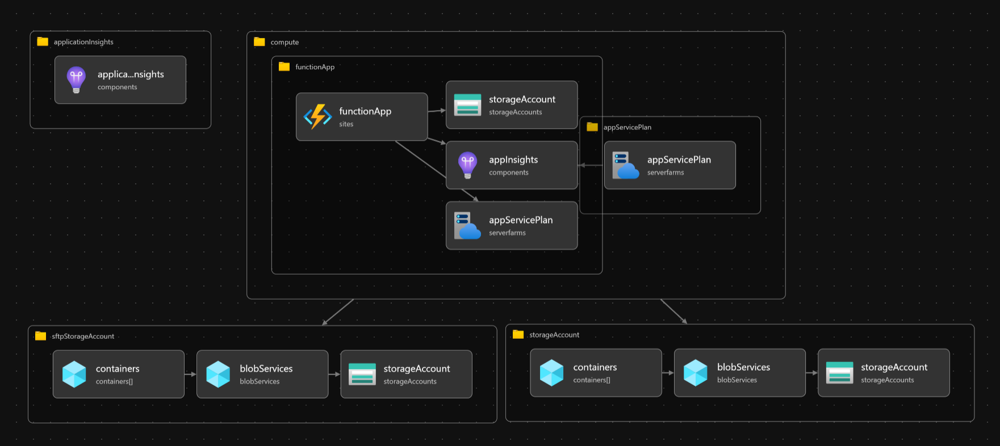

# AutoBicepSuite

## 📂 Project Structure

The project consists of the following files and directories:

azureScript.ps1
compute.bicep
main.bicep
main.parameters.json
module/
app-service-plan.bicep
application-insight.bicep
function-app.bicep
storage-account.bicep
README.md

## 🛠️ Prerequisites

Before you can deploy this project, you will need:

- An Azure account with an active subscription.
- The Azure CLI installed on your local machine.
- PowerShell for running the `azureScript.ps1` script.
- GitHub account to setup the GitHub Actions workflow.

## ⚠️ Note

The Azure resources used in this project are temporary as they are part of an Azure Cloud Sandbox which was purchased temporarily. Please ensure to replace these resources with your own before deploying the project.

This image represents the deployed Azure resources in the project.

## 📄 Main Files

The `main.bicep` and `compute.bicep` files are responsible for setting up the main resources and compute resources for the project, respectively. They define various parameters such as the location, tags, and names of the resources, and they also include modules for deploying these resources.

The `main.parameters.json` file provides the values for these parameters, such as the names of the storage account, application insights resource, app service plan, and function app, as well as the SKU for the storage account and app service plan, and an API key.

The `azureScript.ps1` file is a PowerShell script that sets up Azure contexts, creates Azure AD applications, and assigns the Contributor role to the application. It also writes Azure secrets to the console. This script is essential for setting up the necessary Azure resources and permissions before deploying the resources defined in the `.bicep` files.

## 📁 Module Directory

The `module` directory contains `.bicep` files for each of the resources that are deployed, including the storage account, application insights resource, app service plan, and function app.

## 🚀 GitHub Actions Workflow

The GitHub Actions workflow in [workflow.yml](.github/workflows/workflow.yml) consists of five jobs:

1. **Setup**: This job runs on the latest Ubuntu environment and sets up the Azure Resource Group.

2. **Lint**: This job uses the workflow defined in [lint.yml](.github/workflows/lint.yml). It checks the syntax of your Bicep files by running `az bicep build --file main.bicep`.

3. **Validate**: This job uses the workflow defined in [validate.yml](.github/workflows/validate.yml). It signs in to Azure using the provided secrets and performs a preflight validation of your Bicep templates using the `azure/arm-deploy@v1` action. It uses the `main.bicep` file as the template and `main.parameters.json` for the parameters.

4. **Preview**: This job uses the workflow defined in [preview.yml](.github/workflows/preview.yml). It previews the Azure Resource before the actual deployment.

5. **Deploy**: This job uses the workflow defined in [deploy.yml](.github/workflows/deploy.yml). It depends on the successful completion of the `lint`, `validate`, and `preview` jobs. It signs in to Azure and deploys your Bicep templates to the specified resource group using the `azure/arm-deploy@v1` action.

The workflow can be manually triggered using the `workflow_dispatch` event.

## 📚 Resources

- [Azure Bicep documentation](https://docs.microsoft.com/en-us/azure/azure-resource-manager/bicep/overview)
- [GitHub Actions documentation](https://docs.github.com/en/actions)
- [Azure CLI documentation](https://docs.microsoft.com/en-us/cli/azure/)

## 📝 License

This project is [MIT](https://opensource.org/licenses/MIT) licensed.
